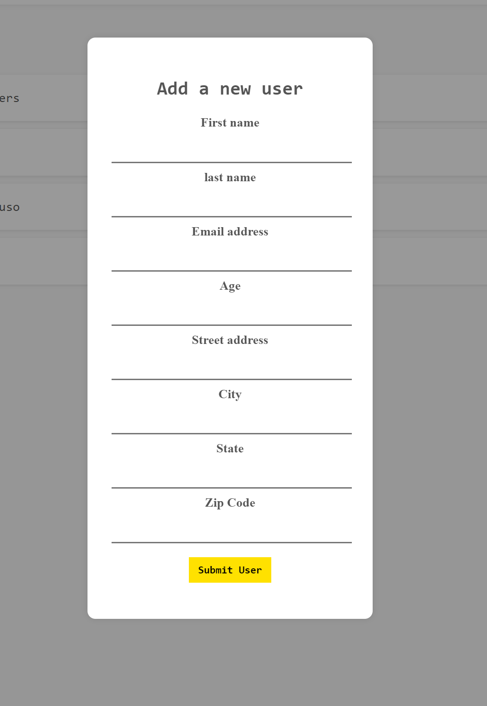
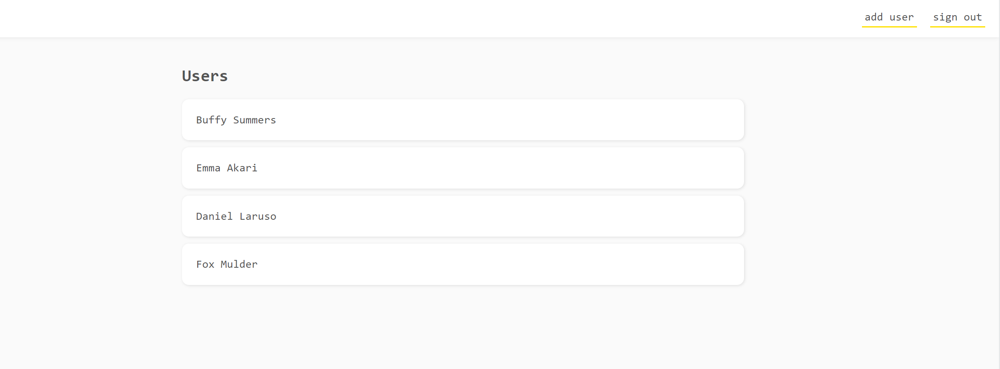
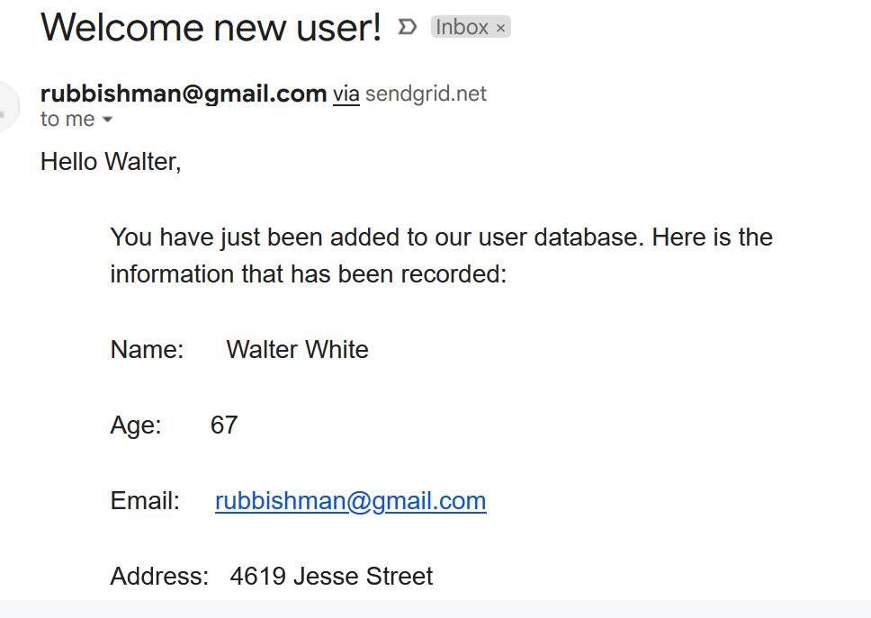

# User Database

An app where you can log in and add people to the database. Users added to the database will automatically be sent an email telling them what information was recorded.

Try it out: [User Database](https://user-database-84d38.web.app/)

### Here's some picture of the app:

<strong>Form for users to fill out people that need to be added to the database:</strong>



<strong>List of all users:</strong>



<strong>Email that is sent out to all registered users:</strong>


## Project setup

```
firebase serve
```

## Built with

- [Javascript](https://developer.mozilla.org/en/JavaScript)
- [CSS](https://developer.mozilla.org/en-US/docs/Web/CSS)
- [Firebase](https://firebase.google.com/)
- [Google Cloud Functions](https://firebase.google.com/docs/functions)

## Contributing

Pull requests are welcome. For major changes, please open an issue first to discuss what you would like to change.

## License

[MIT](https://choosealicense.com/licenses/mit/)

## Author

Garrett Chun - [![Github][1.1]][1] [![Twitter][1.2]][2]

[1.1]: http://i.imgur.com/9I6NRUm.png
[1.2]: ./public/assets/twitter20.png
[1]: https://github.com/KapakahiCoder
[2]: http://www.twitter.com/KapakahiCoder
